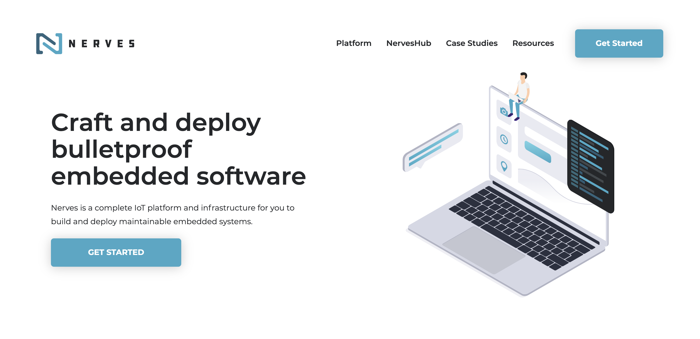
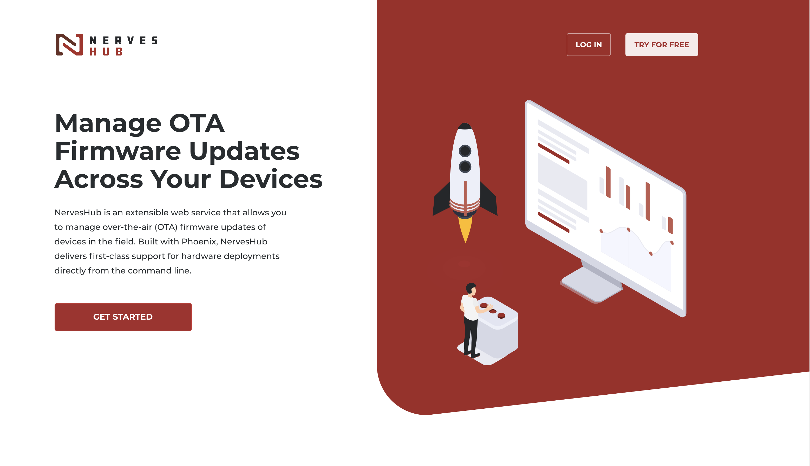

footer: ElixirConfEU · **@arkh4m**
build-lists: true
theme: Olive Green, 9
text: Source Sans Pro Regular
text-strong: #FFFFFF, Source Sans Pro Bold
header: Source Sans Pro Bold
header-strong: #FFFFFF, Source Sans Pro Bold
quote: Source Sans Pro Italic
footer-style: text-scale(1.5)

# Taking back
# control of
# your life
# with Nerves

---

# Hello! 🐒

---

# My name is Ju 🙇🏻‍♂️

---

# _whoami_

- I was born in 🇨🇳
- Grew up in 🇮🇹
- Live in 🇬🇧
- Work for **no**red**ink** 📚

---

# Structure of this talk

1. Doom & Gloom
2. What we can do about it

---

> What, then, is to be done?  To make the best of what is in our power, and take the rest as it naturally happens.
-- Epitectus

---

# What this is talk
# is **NOT** going
# to be about

---

---

[.background-color: #FFFFFF]

---

# [Amazon workers are listening to what you tell Alexa (Bloomberg)](https://www.bloomberg.com/news/articles/2019-04-10/is-anyone-listening-to-you-on-alexa-a-global-team-reviews-audio)

---

# [Amazon confirms it retains your Alexa voice recordings indefinitely (TNW)](https://thenextweb.com/security/2019/07/03/amazon-confirms-it-retains-your-alexa-voice-recordings-indefinitely/)

---

# [Judge orders Amazon to turn over Echo recordings (TechCrunch)](https://techcrunch.com/2018/11/14/amazon-echo-recordings-judge-murder-case/)

---

# [Alexa, are you invading my privacy? The dark side of our voice assistants (The Guardian)](https://www.theguardian.com/technology/2019/oct/09/alexa-are-you-invading-my-privacy-the-dark-side-of-our-voice-assistants)

---

# [Alexa, are you invading my privacy? The dark side of our voice assistants (The Guardian)](https://www.theguardian.com/technology/2019/oct/09/alexa-are-you-invading-my-privacy-the-dark-side-of-our-voice-assistants)

> “I felt a bit foolish,” he says. “Having worked at Amazon, and having seen how they used people’s data, I knew I couldn’t trust them.”

---

[.quote: text-scale(4.0)]

> 🙃

---

[.background-color: #A7A9A6]

---
[.text-emphasis: #CB6226]

> One _ring_ to bring them all,
> and in the darkness bind them.
-- Sauron, The Dark Lord

---

---

# Oh, Yes.

---

# [Doorbell-camera firm Ring has partnered with 400 police forces, extending surveillance concerns (The Washington Post)](https://www.washingtonpost.com/technology/2019/08/28/doorbell-camera-firm-ring-has-partnered-with-police-forces-extending-surveillance-reach)

---

# [Doorbell-camera firm Ring has partnered with 400 police forces, extending surveillance concerns (The Washington Post)](https://www.washingtonpost.com/technology/2019/08/28/doorbell-camera-firm-ring-has-partnered-with-police-forces-extending-surveillance-reach)

> Ring is owned by Amazon, which bought the firm last year for more than $800 million, financial filings show. Amazon founder Jeff Bezos owns The Washington Post.

---

# Oh, No.

---

# So what's the point?

---

# The Point™

1. As a user of a smart device, you have literally no control over what it does.
2. No matter how well intentioned you think the maker is.
3. One day they will get acquired.
4. If you're lucky, all your data will be sold.
4. If you're unlucky, your device will be bricked.

---

# [Snips, privacy-by-default voice technology, acquired by Sonos](https://investors.sonos.com/news-and-events/investor-news/latest-news/2019/Sonos-Announces-Acquisition-of-Snips/default.aspx)

---

# [Revolv devices bricked as Google's Nest shuts down smart home company](https://www.theguardian.com/technology/2016/apr/05/revolv-devices-bricked-google-nest-smart-home)

---

# What's the alternative?

---

[.header: text-scale(10.0)]

# DIY

---

# The only way trust a smart device is to know exactly what it does.

---

# And the only way to do that is to build it yourself.

---

# No, there is no other way.

---

# I know. It's takes time and effort to become a circuit whisperer.

---

# But as engineers we are in a TRULY privileged position to fight back.

---

> Any sufficiently advanced technology is indistinguishable from magic.
-- Arthur C. Clarke

---

[.background-color: #FFFFFF]

---

[.background-color: #FFFFFF]

---

[.background-color: #FFFFFF]

---

# My First World Problem

1. Go to the kitchen and fill up the moka.
2. Put it on the stove on a low setting.
3. Go back to my office to work on some stuff.
4. Keep doors open so I can hear the rumbling.
5. Get distracted.
6. Run to the kitchen when it's too late.
7. Burnt coffee 😿

---

# But.. What if I built a machine which tells me when the coffee is ready?

---

# DEMO TIME ☕️

---

---

# ANOTHER DEMO ☕️

---

# Thank you! 🙏

🦜 [@arkh4m](https://twitter.com/arkh4m)
☕️ [github.com/Arkham/mokay](https://github.com/Arkham/mokay)
🤖 [github.com/Arkham/tee\_eff\_elle](https://github.com/Arkham/tee_eff_elle)

---

# References

[Nerves Getting Started](https://hexdocs.pm/nerves/getting-started.html)
[NervesHub Setup](https://docs.nerves-hub.org/nerves-hub/setup)
